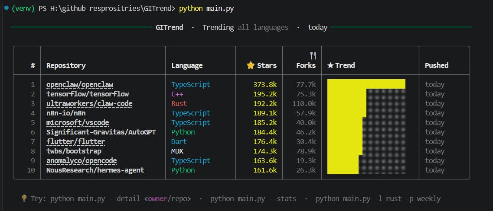
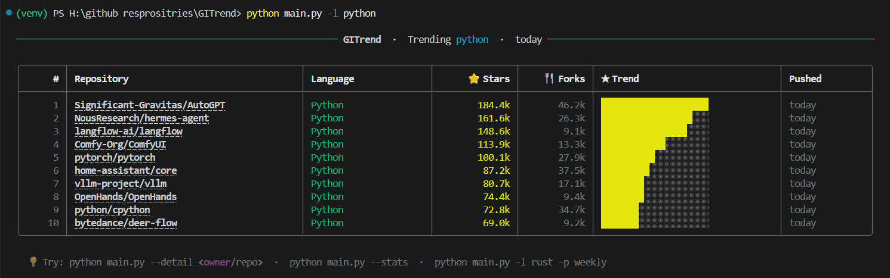
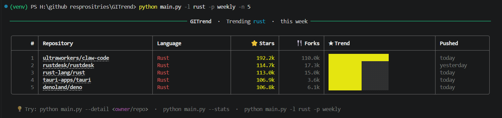
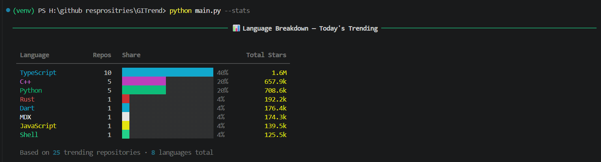
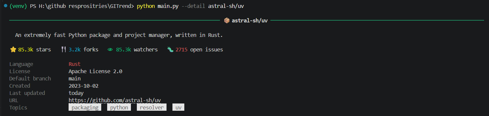

# GITrend — GitHub Trending Explorer

A CLI tool to explore trending GitHub repositories with rich terminal visuals.
Filter by language, time period, see language stats, and inspect any repo — all from your terminal.

🌐 **Live Web Demo → [asra-bukhari.github.io/GITrend](https://asra-bukhari.github.io/GITrend/)**

---

## Screenshots

### Trending today (all languages)


### Python repos


### Top 5 Rust repos this week


### Language stats chart


### Repo detail view


---

## Folder Structure

```
GITrend/
├── main.py            # CLI entry point (argparse)
├── github_client.py   # GitHub API wrapper (retries, caching, error handling)
├── display.py         # Rich terminal visuals (tables, bars, charts)
├── requirements.txt   # Dependencies
├── index.html         # Web version (live demo)
├── screenshots/       # Sample output screenshots
├── .cache.json        # Auto-generated local cache (gitignored)
└── README.md
```

---

## Setup & Run (Fresh Machine)

### 1. Clone the repo

```bash
git clone https://github.com/asra-bukhari/GITrend.git
cd GITrend
```

### 2. Create a virtual environment (recommended)

```bash
python -m venv venv

# macOS / Linux
source venv/bin/activate

# Windows
venv\Scripts\activate
```

### 3. Install dependencies

```bash
pip install -r requirements.txt
```

### 4. Run it

```bash
python main.py
```

### 5. (Optional) Set a GitHub token for higher rate limits

Without a token, GitHub allows ~10 unauthenticated requests/minute.
With a free token, you get 30x more headroom.

1. Go to https://github.com/settings/tokens → "Generate new token (classic)"
2. No scopes needed (public data only)
3. Copy the token, then:

```bash
# macOS / Linux
export GITHUB_TOKEN=ghp_yourtoken

# Windows (PowerShell)
$env:GITHUB_TOKEN="ghp_yourtoken"
```

---

## Usage

```bash
# Top trending repos today (all languages)
python main.py

# Filter by language
python main.py -l python

# Change time period (daily / weekly / monthly)
python main.py -l javascript -p weekly

# Top 5 Rust repos this week
python main.py -l rust -p weekly -n 5

# Language breakdown chart of today's trending
python main.py --stats

# Detailed info for a specific repo
python main.py --detail astral-sh/uv
```

### All options

| Flag | Description | Default |
|------|-------------|---------|
| `-l`, `--language` | Filter by language (python, rust, go, etc.) | all |
| `-p`, `--period` | `daily`, `weekly`, or `monthly` | `daily` |
| `-n`, `--limit` | Number of repos to show (1–25) | 10 |
| `--stats` | Show language distribution chart | — |
| `--detail owner/repo` | Detailed view of one repo | — |

---

## Error Handling

| Scenario | Behaviour |
|----------|-----------|
| API timeout | Retries up to 3 times with exponential backoff (1s → 2s → 4s) |
| API error (5xx) | Same retry logic, then clear error message |
| Rate limited (403) | Shows when the limit resets + how to fix it |
| Repo not found (404) | Clear "not found" message, no crash |
| No internet | Fails gracefully; uses stale cache if available |
| Bad language input | Typo detection with suggestions |
| Bad `--limit` | Validates range (1–25), exits with message |
| Bad `--detail` format | Checks for `owner/repo` format before calling API |

---

## Requirements

- Python 3.10+
- Internet connection (or stale cache for offline use)
- `requests`, `rich` (installed via requirements.txt)
